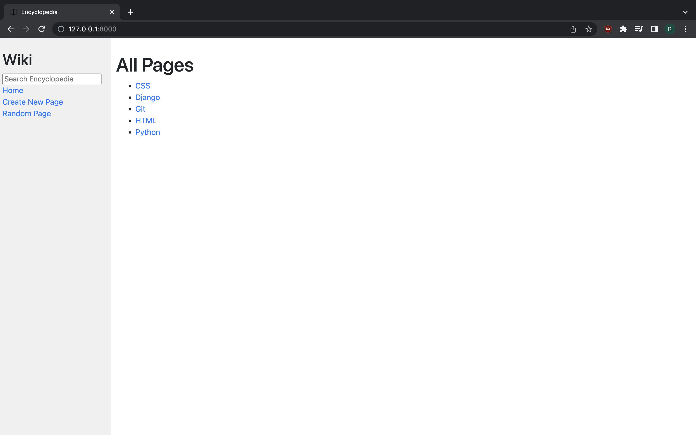
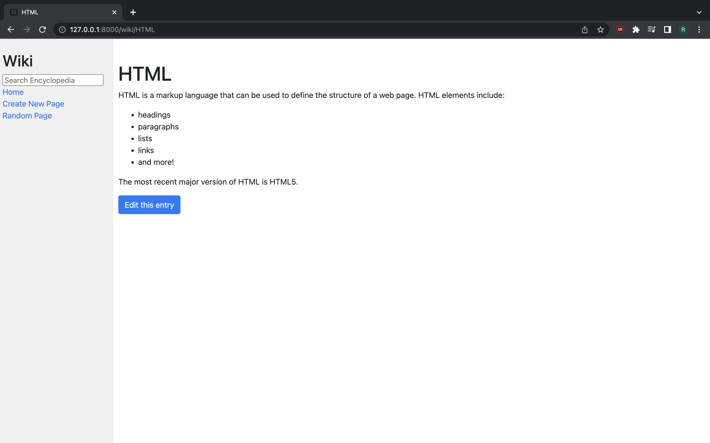
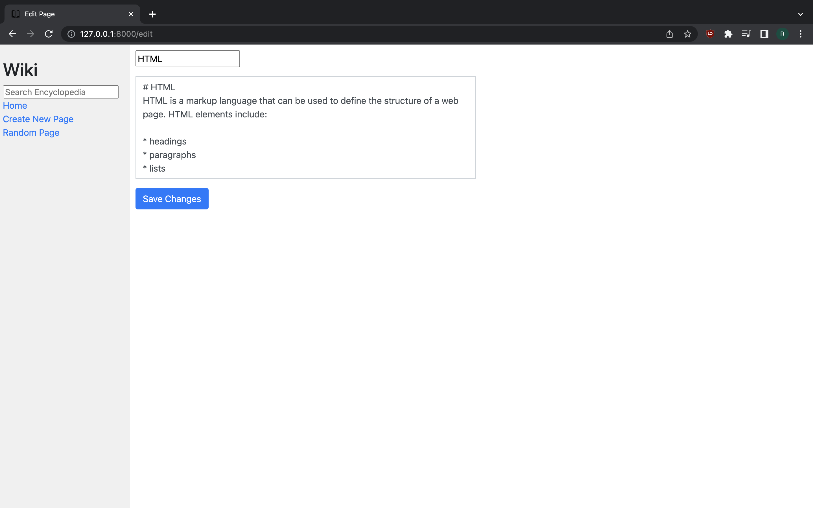

# Wiki

A Wikipedia-like online encyclopedia. Project 1 of HarvardX's CS50w course.

Check out [CS50 Web Programming with Python and JavaScript](https://courses.edx.org/courses/course-v1:HarvardX+CS50W+Web/course/)

[Full project specification](https://cs50.harvard.edu/web/2020/projects/1/wiki/)

## Setup

The first thing to do is clone this repository:

```bash
git clone https://github.com/yestab335/HarvardCourse.git
cd HarvardCourse/project-1
code .
```

Install dependencies:
```bash
pip install -r requirements.txt
```

To run the development server:
```bash
python manage.py runserver
```
## Visuals

You can see a video of this project in action [here](https://youtu.be/2KJzmR9Hz_E)






## Requirements

This website was built with the [Django](https://github.com/django/django) python framework.

[Markdown2](https://github.com/trentm/python-markdown2) was used to convert Markdown to HTML.